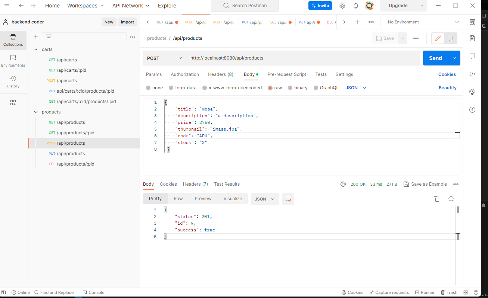

<h1> POSTMAN GESTOR</h1>

<b>CAMBIOS REALIZADOS EN EL ULTIMO COMMIT:</b>

<ul>
<li> HANDLEBARS AÑADIDO Y CONFIGURADO CON ROUTES</li>
<li> DIVISION RUTAS CART Y PRODUCT </li>
<li> VER EL CARRITO DEL ID NUMERO 1</li>
<li> AÑADIR PRODUCTO DESDE LA SIGUIENTE RUTA: localhost:8080/new_product</li>
</ul>
